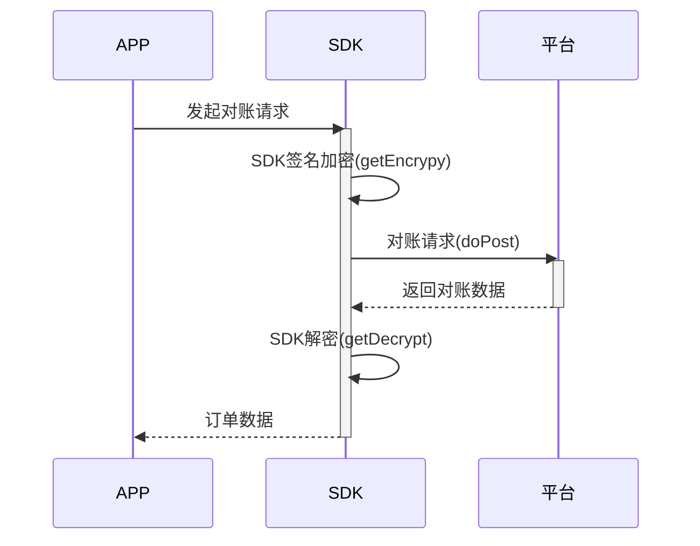

# 商户接入API文档1.0
---
## 1. 修订控制页

| 编号 | 文档版本 | 修订章节 | 修订原因 | 修订日期   | 修订人 |
| ---- | -------- | -------- | -------- | ---------- | ------ |
| 1    | V1.0     | 新增     | 新增     | 2018-10-31 | ljc    |

## 2. 环境地址

| 环境       | 请求地址                  |
| ---------- | :------------------------ |
| 开发环境   | http://baidu.com          |
| 测试环境   | http://baidu.com          |
| 预发布环境 | http://baidu.com          |
| 生产环境   | https://api.chainlong.io​ |

## 3. 公共参数说明

| 参数名字       | 参数类型 | 参数描述       |
| -------------- | -------- | :------------- |
| body           | string   | 封装的json数据 |
| result         | string   | 返回的json数据 |
| url            | string   | 请求地址       |
| params         | string   | 请求参数       |
| token          | string   | 请求头部信息   |
| mbr_public_key | string   | 平台公钥       |
| private_key    | string   | 商户私钥       |

## 4. 平台回调商户接口
+ 此接口需商户方实现，返回字段如下
+ 请求方式 **POST**

| 参数名字  | 参数类型 | 参数描述                                 |
| --------- | -------- | :--------------------------------------- |
| coinId    | string   | 币种ID                                   |
| toaddr    | string   | 转入地址                                 |
| amount    | string   | 金额                                     |
| billType  | string   | 交易类型 0:提现 1：支付                  |
| notifyId  | string   | 回调ID                                   |
| fromAddr  | string   | 转出地址                                 |
| refBizNo  | string   | 订单号                                   |
| payBillNo | string   | 系统订单号                               |
| status    | string   | 状态  0：初始  1：处理中 2：成功 3：失败 |

## 5. 通用工具类
### 1. 支付请求工具类: com.client.utils.PayUtil.PayUtil
-  方法描述

| 返回类型 | 方法                           | 参数描述                                                                        |
| -------- | :----------------------------- | :------------------------------------------------------------------------------ |
| String   | doPost(Map<String,String> map) | 传入参数Map(必须包含请求地址url，参数内容params，认证签名token，返回Json字符串) |
| String   | doPost(String params)          | 传入将参数Map序列化之后的字符串，返回Json字符串                                 |
 


## 6.接口说明
### 1. 商户支付
#### 序列图


#### SDK说明
1. 预支付请求构造: com.client.sdk.request.PrePayCommand
- 构造方法
 
| 方法                                                     | 参数描述                                      |
| :------------------------------------------------------- | :-------------------------------------------- |
| PrePayCommand()                                          | 默认构造方法                                  |
| PrePayCommand(String mbr_public_key, String private_key) | mbr_public_key: 平台公钥,private_key 商户私钥 |

-  方法描述

| 返回类型            | 方法                      | 参数描述                                                                |
| ------------------- | :------------------------ | :---------------------------------------------------------------------- |
| Map<String, String> | getEncrypt(String body)   | 传入序列化后的PrePayRequest对象，返回带有token和加密之后的body的Map对象 |
| String              | getDecrypt(String body)   | 解密，将由服务端返回的加密字符串解密为正常的JSON字符串                  |
| String              | getOrderInfo(String body) | 转换为订单数据                                                          |

2. 预支付请求消息体:com.client.sdk.dto.request.PrePayRequest
- 参数说明

| 参数名字   | 参数类型 | 参数描述 |
| ---------- | -------- | :------- |
| amount     | string   | 金额     |
| coinId     | string   | 币id     |
| merchantId | string   | 商户ID   |
| refBizNo   | string   | 订单ID   |
| channel    | string   | 渠道ID   |
| attach     | string   | 透传参数 |

3. 订单数据
- 参数说明

| 参数名字     | 参数类型 | 参数描述   |
| ------------ | -------- | :--------- |
| amount       | string   | 金额       |
| coinId       | string   | 币id       |
| merchantId   | string   | 商户ID     |
| merchantName | string   | 商户名称   |
| refBizNo     | string   | 订单ID     |
| channel      | string   | 渠道ID     |
| orginAmount  | string   | 原始金额   |
| payBillNo    | string   | 系统订单号 |
| toAddr       | string   | 转出地址   |
| tokenAddr    | string   | 合约地址   |
| txData       | string   | tx数据     |
| sign         | string   | 签名数据   |

4. 方法示例
```java
       //预支付接口调用       
 	PrePayCommand prePayCommand = new PrePayCommand(mbr_public_key, private_key);
        PrePayRequest prePayRequest = new PrePayRequest();
        //商户订单号
        if (StringUtils.isEmpty(refBizNo)){
            refBizNo = String.valueOf(System.currentTimeMillis());
        }
        prePayRequest.setAmount(amount);//传入参数
        prePayRequest.setCoinId(coinId);//传入参数
        prePayRequest.setMerchantId(merchantId);//传入参数
        prePayRequest.setRefBizNo(refBizNo);//传入参数
        prePayRequest.setChannel(channel);//传入参数

        //加密数据
        Map<String, String> encryptResult = prePayCommand.getEncrypt(JSONObject.toJSONString(prePayRequest));

        //构建预支付请求
        Map<String,String> preMap = new HashMap<>();
        preMap.put("url", "https://api.chainlong.io/dcpayCore/payBills/prepay");
        preMap.put("params",encryptResult.get("body"));
        preMap.put("token",encryptResult.get("token"));
        //加密成功后发送预支付请求
        String encryptPrePayResult = PayUtil.doPost(JSONObject.toJSONString(preMap));
        //解密结果
        String decryptPrePayResult = prePayCommand.getDecrypt(encryptPrePayResult);
        String orderInfo = prePayCommand.getOrderInfo(decryptPrePayResult);
        //返回格式和数据
        Map<String, Object> result = new HashMap<String, Object>();
        result.put("code", 200);
        result.put("data", orderInfo);
```

### 2. 商户提现

#### 序列图


#### SDK说明
1. 提现方法类: com.client.sdk.request.TransactionCommand
- 构造方法
 
| 方法                                                                                 | 参数描述                                                                        |
| :----------------------------------------------------------------------------------- | :------------------------------------------------------------------------------ |
| TransactionCommand(String mbr_public_key, String private_key,String private_key_hex) | mbr_public_key: 平台公钥,private_key 商户私钥 ,private_key_hex:平台提现地址私钥 |

-  方法描述

| 返回类型            | 方法                                                   | 参数描述                                                          |
| ------------------- | :----------------------------------------------------- | :---------------------------------------------------------------- |
| Map<String, String> | getEncrypt(String body)                                | 传入序列化后的提现请求Map，返回带有token和加密之后的body的Map对象 |
| String              | getDecrypt(String body)                                | 解密，将由服务端返回的加密字符串解密为正常的JSON字符串            |
| Map<String, String> | getCoin(Map<String, String> body)                      | 查询币列表,返回币种信息                                           |
| String              | getSignTx(Map<String, String> coin,String txCreateUrl) | 获取交易签名                                                      |

2. 请求币列表查询参数
- 参数说明

| 参数名字    | 参数类型 | 参数描述 |
| ----------- | -------- | :------- |
| coinId      | string   | 币id     |
| merchantId  | string   | 商户ID   |
| channel     | string   | 渠道ID   |
| coinLIstUrl | string   | 请求地址 |

3. 返回币参数
- 参数说明

| 参数名字     | 参数类型 | 参数描述 |
| ------------ | -------- | :------- |
| coinId       | string   | 币id     |
| decimals     | string   | 精度     |
| tokenAddress | string   | 合约地址 |
| addressFrom  | string   | 转出地址 |

4. 提现请求参数
- 参数说明

| 参数名字   | 参数类型 | 参数描述   |
| ---------- | -------- | :--------- |
| merchantId | string   | 商户ID     |
| amount     | string   | 金额       |
| refBizNo   | string   | 订单ID     |
| coinId     | string   | 币id       |
| fromAddr   | string   | 转出地址   |
| toAddr     | string   | 转入地址   |
| txHash     | string   | 交易哈希   |
| signedTx   | string   | 签名数据   |
| attach     | string   | 透传数据   |
| payBillNo  | string   | 系统订单号 |
| tokenAddr  | string   | 合约地址   |

#### 方法示例

```java
        TransactionCommand transactionCommand = new TransactionCommand(mbr_public_key, private_key, private_key_hex);
        //获取指定的币对象
        Map<String, String> coinQueryParams = new HashMap<String, String>();
        coinQueryParams.put("merchantId", merchantId);
        coinQueryParams.put("channel", channel);
        coinQueryParams.put("coinListUrl",”https://api.chainlong.io/client/merchant/withdraw/queryWithdrawCoin”);
        coinQueryParams.put("coinId", coinId);
        Map<String, String> coinMap = transactionCommand.getCoin(coinQueryParams);


        //添加参数
        coinMap.put("coinId", coinId);
        coinMap.put("merchantId", merchantId);
        coinMap.put("amount", amount);
        coinMap.put("addressTo", addressTo);
        coinMap.put("channel",channel);

        //注：如果不添加gasPrice或者gasLimit则采用后台系统的默认值
        coinMap.put("gasPrice", "200000000000");
        coinMap.put("gasLimit", "2000000");


        //获取signTx
        String nonceAndSignedTx = transactionCommand.getNonceAndSignTx(coinMap,"https://api.chainlong.io/client/tx/txCreate");
        String[] ns = nonceAndSignedTx.split("&");

        //组装提现参数
        Map<String, String> withdrawRequest = new HashMap<String, String>();
        withdrawRequest.put("merchantId", merchantId);
        withdrawRequest.put("amount", amount);
        withdrawRequest.put("refBizNo", String.valueOf(System.currentTimeMillis()));
        withdrawRequest.put("coinId", coinMap.get("coinId"));
        withdrawRequest.put("fromAddr", coinMap.get("addressFrom"));
        withdrawRequest.put("toAddr", addressTo);
        withdrawRequest.put("nonce", ns[0]);
        withdrawRequest.put("signedTx", ns[1]);
        withdrawRequest.put("tokenAddr", coinMap.get("tokenAddress"));
        withdrawRequest.put("channel", channel);

        //加密提现请求
        Map<String,String> txEncryptFinalMap = transactionCommand.getEncrypt(JSONObject.toJSONString(withdrawRequest));
        Map<String,String> txFinalPostMap = new HashMap<String ,String>();
        txFinalPostMap.put("url", "https://api.chainlong.io/dcpayCore/payBills/withdraw");
        txFinalPostMap.put("params",txEncryptFinalMap.get("body"));
        txFinalPostMap.put("token",txEncryptFinalMap.get("token"));
        String resultTxFinal = PayUtil.doPost(JSONObject.toJSONString(txFinalPostMap));
        //解密提现请求结果.   注：若没有成功，会抛出一个Exception
        String finalResult = transactionCommand.getDecrypt(resultTxFinal);
```

### 3. 商户对账

#### 序列图


#### SDK说明
1. 对账方法类: com.client.sdk.request.AccountCheckCommand
- 构造方法
 
| 方法                                                           | 参数描述                                      |
| :------------------------------------------------------------- | :-------------------------------------------- |
| AccountCheckCommand(String mbr_public_key, String private_key) | mbr_public_key: 平台公钥,private_key 商户私钥 |

-  方法描述

| 返回类型            | 方法                    | 参数描述                                                                  |
| ------------------- | :---------------------- | :------------------------------------------------------------------------ |
| Map<String, String> | getEncrypt(String body) | 传入序列化后的订单列表查询参数Map，返回带有token和加密之后的body的Map对象 |
| String              | getDecrypt(String body) | 解密，将由服务端返回的加密字符串解密为正常的JSON字符串                    |


2. 请求订单列表查询参数
- 参数说明

| 参数名字   | 参数类型 | 参数描述   |
| ---------- | -------- | :--------- |
| orderNo    | long[]   | 订单ID数组 |
| merchantId | string   | 商户ID     |
| channel    | string   | 渠道ID     |

3. 返回的订单结果
- 参数说明

| 参数名字     | 参数类型 | 参数描述                                 |
| ------------ | -------- | :--------------------------------------- |
| merchantName | string   | 商户名称                                 |
| amount       | string   | 金额                                     |
| refBizNo     | string   | 订单ID                                   |
| parentNo     | string   | 交易号                                   |
| coinName     | string   | 币名称                                   |
| fromAddr     | string   | 转出地址                                 |
| toAddr       | string   | 转入地址                                 |
| tokenAddr    | string   | 合约地址                                 |
| txHash       | string   | 交易哈希                                 |
| attach       | string   | 透传数据                                 |
| billType     | int      | 交易类型 0：支付 1：提现                 |
| status       | int      | 交易状态 0：初始 1：处理中 2成功 3：失败 |
| createTime   | date     | 创建时间                                 |
| completeTime | date     | 完成时间                                 |


#### 方法示例
```java
        //传入参数
        //Long[] orderNo, 订单数组
        //String merchantId, 商户ID
        //String channel,渠道号
        // String private_key  商户私钥
        AccountCheckCommand accountCheckCommand = new AccountCheckCommand(mbr_public_key, private_key);
        QueryRefBillNoRequest req = new QueryRefBillNoRequest();
        req.setOrderNo(orderNo);//传入参数
        req.setMerchantId(merchantId);//传入参数
        req.setChannel(channel);//传入参数
        //加密
        Map<String, String> encryptMap = accountCheckCommand.getEncrypt(JSONObject.toJSONString(req));
        Map<String,String> doPostMap = new HashMap<>();
        doPostMap.put("url","https://api.chainlong.io/dcpayCore/payBills/queryByOrderNo");
        doPostMap.put("params",encryptMap.get("body"));
        doPostMap.put("token",encryptMap.get("token"));
        //发送请求
        String doPostResult = PayUtil.doPost(JSONObject.toJSONString(doPostMap));
        //解密数据
        String decryptResult = accountCheckCommand.getDecrypt(doPostResult);
```

